# Customer Segmentation & Insurance Policy Prediction

An end-to-end exploratory data analysis and machine learning project identifying 
high-value insurance customers using sociodemographic profiles and product ownership 
data from the COIL 2000 dataset.

## Project Overview

This project analyzes 5,822 customer records from a Dutch insurance company to answer 
one core business question: **who is most likely to purchase a mobile home insurance policy?**

Using a combination of statistical analysis, clustering, and classification modeling, 
the analysis uncovers distinct customer segments and builds predictive models to identify 
likely policy buyers — a directly actionable insight for targeted marketing campaigns.

## Dataset

**Source:** UCI Machine Learning Repository — [Insurance Company Benchmark (COIL 2000)](https://archive.ics.uci.edu/dataset/125/insurance+company+benchmark+coil+2000)  
**Origin:** Real world data supplied by Sentient Machine Research, a Dutch data mining company  
**Size:** 5,822 training records, 86 variables  
**Target Variable:** CARAVAN — binary indicator of mobile home policy ownership (0 or 1)

The sociodemographic variables (columns 1–43) are derived from zip codes, meaning all 
customers in the same zip code area share identical demographic attributes. Product 
ownership variables (columns 44–86) reflect individual customer behavior.

## Methods

### Exploratory Data Analysis
- Descriptive statistics (mean, median, mode, variance, skewness, kurtosis)
- Univariate analysis with histograms, KDE plots, and boxplots
- Bivariate analysis with Pearson correlation matrix and scatter plots

### Statistical Testing
- Independent samples t-test (income differences by policy ownership)
- Chi-squared test of independence (car ownership rates vs policy ownership)
- One-way ANOVA (income differences across customer segments)

### Modeling
| Model | Task | ROC-AUC | R² |
|-------|------|---------|-----|
| Logistic Regression | Binary classification (CARAVAN) | 0.757 | — |
| Random Forest | Binary classification (CARAVAN) | 0.671 | — |
| Linear Regression | Predicting car insurance contribution | — | 0.00 (poor fit — see residual diagnostics) |

### Advanced Analysis
- **K-Means Clustering** (k=4) to identify natural customer segments
- **PCA** for dimensionality reduction and cluster visualization

## Key Findings

- The dataset contains four distinct customer segments with meaningfully different 
  demographic and behavioral profiles
- **Cluster 1** (n=344) showed a 100% mobile home policy ownership rate — every customer 
  in this segment owns a CARAVAN policy. They are characterized by high purchasing power, 
  above average income, and high car insurance contributions
- Logistic regression outperformed Random Forest for detecting the minority class, 
  achieving a ROC-AUC of 0.757 vs 0.671
- Sociodemographic variables alone show near-zero correlation with individual product 
  ownership, confirming that neighborhood-level demographics must be combined with 
  existing product behavior for effective targeting
- MKOOPKLA (purchasing power class) was the strongest individual predictor of mobile 
  home policy ownership according to Random Forest feature importance

---

## Visualizations

### Data Distributions

> Sociodemographic variables follow relatively smooth distributions, while insurance 
> product variables are heavily concentrated at zero — reflecting that most customers 
> hold zero policies for niche products like life insurance and mobile home coverage.

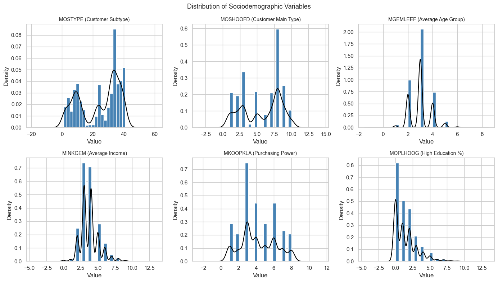
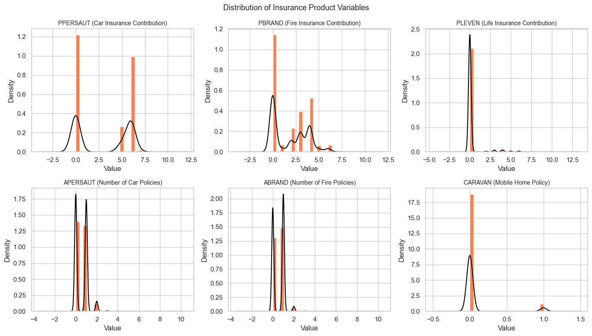

---

### Outlier Analysis

> Boxplots confirm that sociodemographic variables contain no problematic outliers 
> requiring removal. Insurance product variables show many outlier dots above the 
> whiskers — these represent genuine customers who hold those policies and were 
> intentionally kept in the dataset.

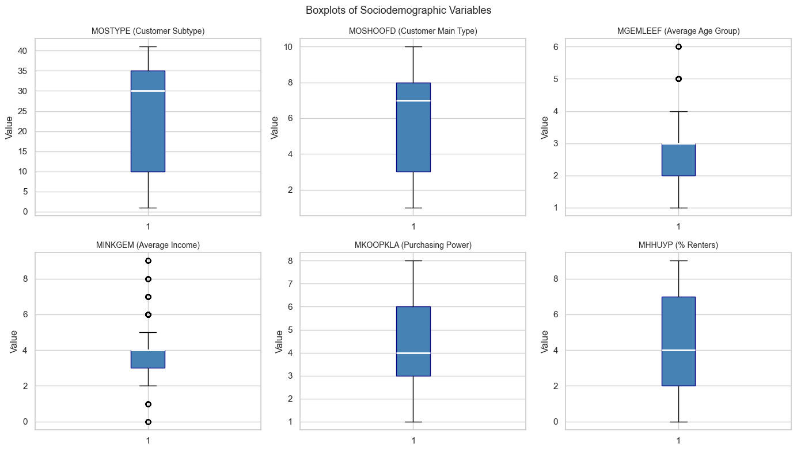
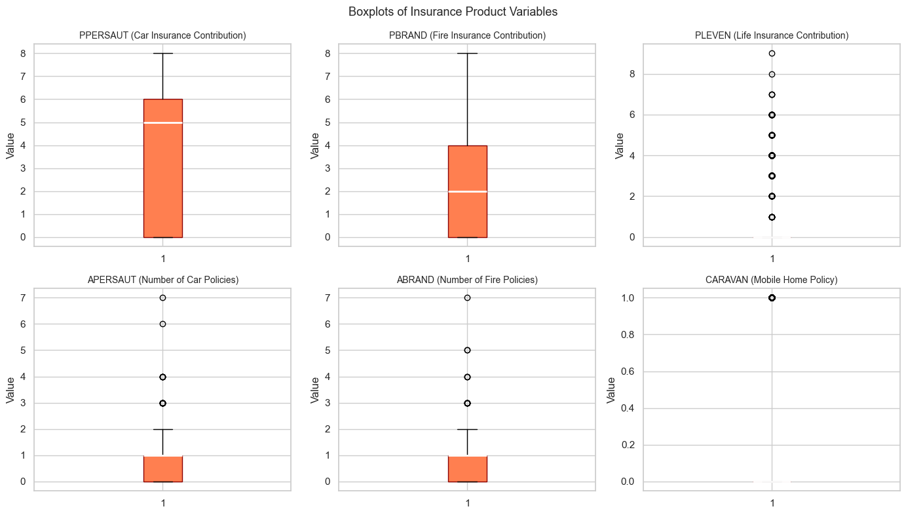

---

### Bivariate Analysis

> The correlation heatmap reveals two distinct clusters of relationships — one within 
> sociodemographic variables and one within insurance product variables. Cross-group 
> correlations are nearly zero, meaning no single demographic variable is a strong 
> linear predictor of product ownership on its own.

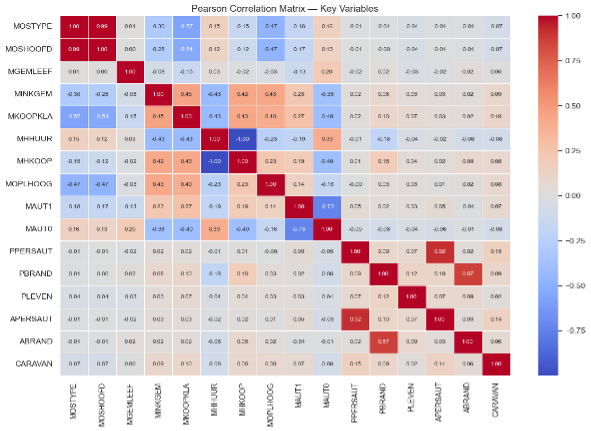

> Scatter plots confirm key relationships: car policy count scales linearly with 
> contribution amounts, income moderately predicts purchasing power, and renter vs 
> homeowner percentages are near-perfectly inversely correlated across zip codes.

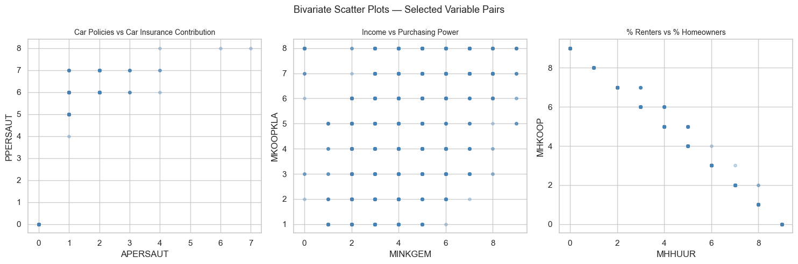

---

### Regression Diagnostics

> Residual diagnostics reveal that linear regression is not well suited for predicting 
> car insurance contribution levels. The banded residual pattern reflects the discrete, 
> ordinal nature of the target variable — a tree-based or ordinal model would be more 
> appropriate for this task.

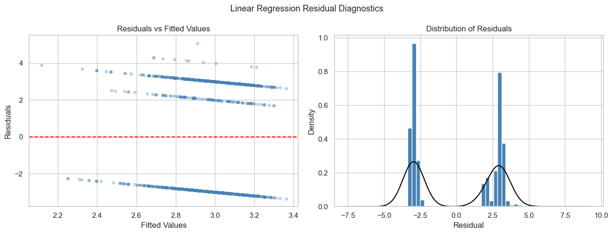

---

### Classification — Logistic Regression

> Logistic regression achieved a ROC-AUC of 0.757, correctly identifying 72% of actual 
> mobile home policy owners. The high false positive rate is an acceptable tradeoff in a 
> marketing context — casting a wide net is preferable to missing true buyers entirely 
> when the positive class represents only 6% of customers.

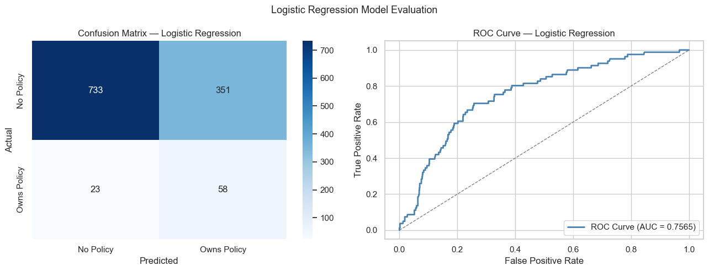

---

### Clustering — K-Means + PCA

> The elbow plot shows inertia flattening around k=4, supporting the choice of four 
> customer segments. The PCA visualization shows meaningful separation between clusters, 
> with Cluster 1 (coral) standing apart as the high-value mobile home policy owner 
> segment — every customer in this cluster owns a CARAVAN policy.

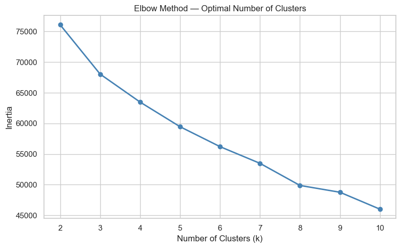
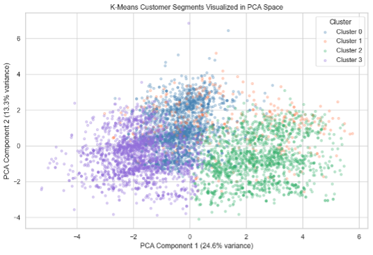

---

### Classification — Random Forest

> While Random Forest achieved higher overall accuracy (89%), it underperformed logistic 
> regression on ROC-AUC (0.671 vs 0.757) for detecting the minority class. The feature 
> importance chart confirms that purchasing power class (MKOOPKLA), car ownership rate 
> (MAUT1), and average income (MINKGEM) are the strongest predictors of mobile home 
> policy ownership.

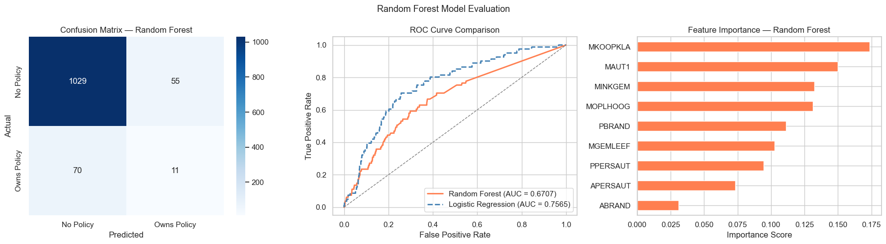

---

## Tools & Libraries

- **Python** — pandas, numpy, scipy
- **Visualization** — matplotlib, seaborn
- **Machine Learning** — scikit-learn (LogisticRegression, RandomForestClassifier, 
  KMeans, PCA, StandardScaler)

## Files
├── customer_segmentation_insurance_analysis.ipynb   # Full analysis notebook
├── customer_segmentation_insurance_narrative.pdf    # Project narrative
└── data/
├── ticdata2000.txt      # Training data (5,822 records)
├── ticeval2000.txt      # Evaluation data (4,000 records)
├── tictgts2000.txt      # Evaluation targets
├── TicDataDescr.txt     # Full data description
└── dictionary.txt       # Variable data dictionary
└── images/
├── sociodemographic_distributions.png
├── insurance_product_distributions.png
├── sociodemographic_boxplots.png
├── insurance_product_boxplots.png
├── correlation_heatmap.png
├── bivariate_scatter_plots.png
├── regression_residual_diagnostics.png
├── logistic_regression_evaluation.png
├── elbow_method.png
├── pca_clusters.png
└── random_forest_evaluation.png

## Reference

Van der Putten, P., & Van Someren, M. (2000). *CoIL challenge 2000: The insurance 
company case.* Sentient Machine Research. 
https://archive.ics.uci.edu/dataset/125/insurance+company+benchmark+coil+2000
